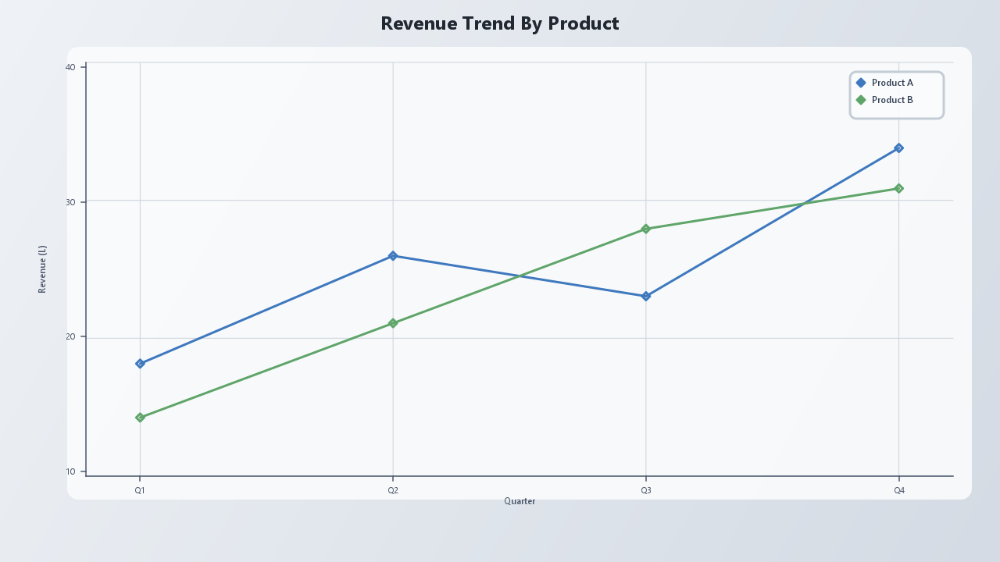
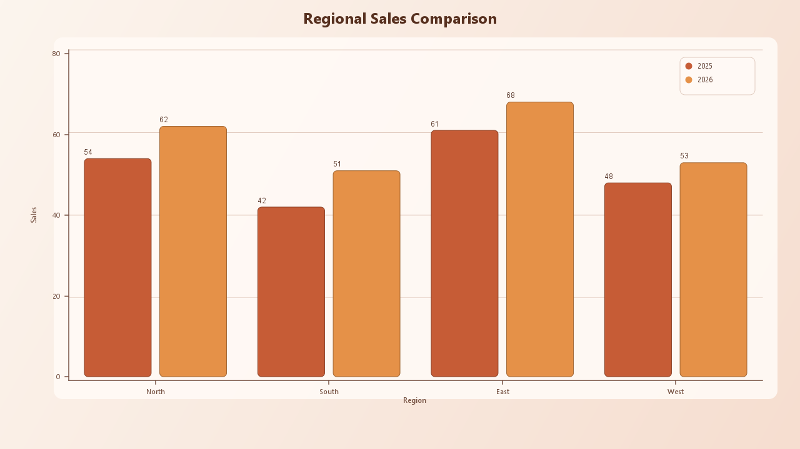
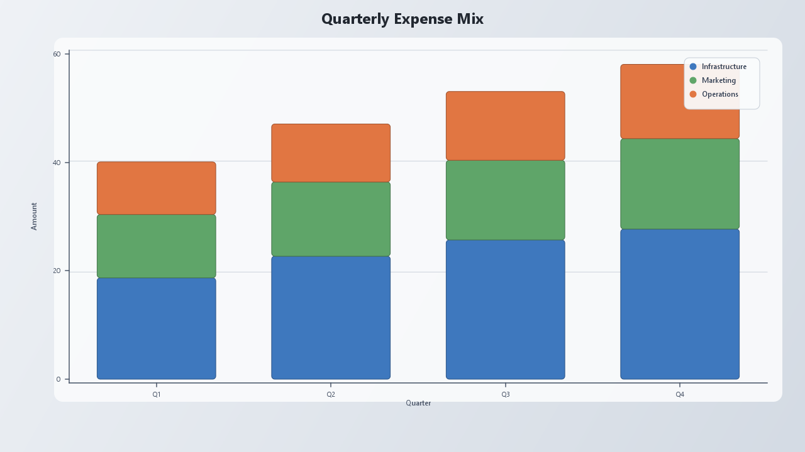
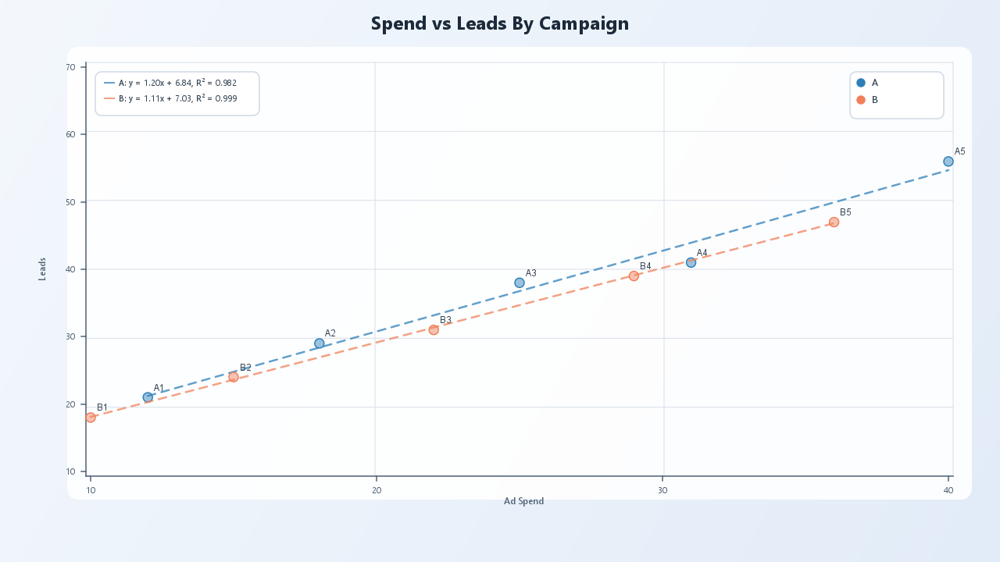
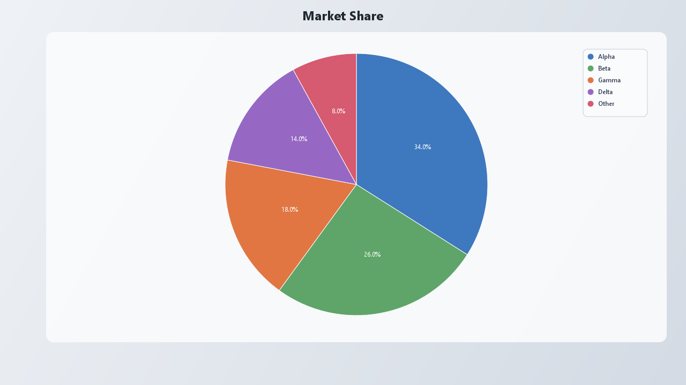
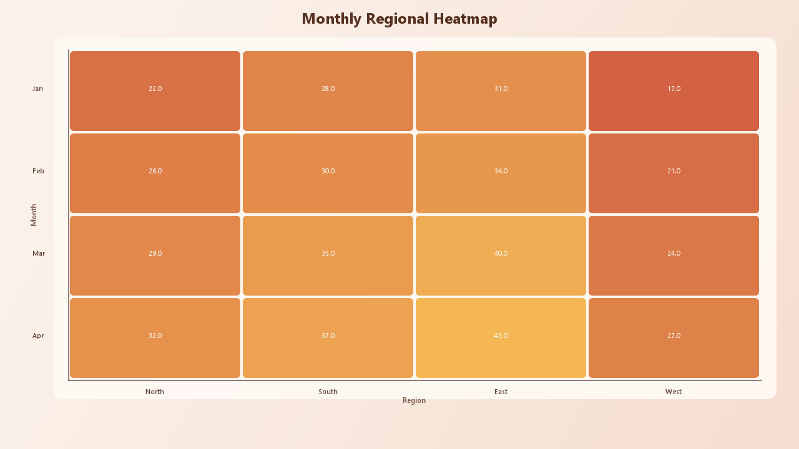

# JPlotX

[](https://github.com/KalyaniFulpagare/JxPlotLib)
[](https://central.sonatype.com/artifact/io.github.kalyanifulpagare/jplotx)
[](https://www.oracle.com/java/)
[](LICENSE)

JPlotX is a Java charting library for generating PNG charts from Java code, CSV files, and MySQL data.

## Gallery

| | |
|---|---|
|  |  |
|  |  |
|  |  |

## Install

```xml
<dependency>
    <groupId>io.github.kalyanifulpagare</groupId>
    <artifactId>jplotx</artifactId>
    <version>1.0.1</version>
</dependency>
```

## Quick Start

```java
import com.jplotx.JPlotX;
import java.util.List;
import java.nio.file.Path;

new JPlotX();
JPlotX.line()
    .title("Revenue Trend")
    .xLabel("Quarter")
    .yLabel("Revenue")
    .values(List.of(1d, 2d, 3d), List.of(10d, 25d, 18d))
    .trendLine()
    .export(Path.of("exports"), "revenue-trend");
```

## Plain Java Project

For a plain Java project, add `jplotx-1.0.1.jar` to the build path and use Java 17 or newer.

Direct jar:
https://repo1.maven.org/maven2/io/github/kalyanifulpagare/jplotx/1.0.1/jplotx-1.0.1.jar

For MySQL features, also add MySQL Connector/J.

## Aggregate Raw Data

```java
import com.jplotx.JPlotX;
import com.jplotx.data.table.Aggregation;
import com.jplotx.data.table.DataTable;
import java.nio.file.Path;

JPlotX jPlotX = new JPlotX();
DataTable raw = jPlotX.loadCsv(Path.of("data", "movie_ticket_dataset.csv"));
DataTable monthly = raw.aggregateBy("month", "total_revenue", Aggregation.SUM, "monthly_revenue");

JPlotX.line()
    .title("Monthly Revenue")
    .xLabel("Month")
    .yLabel("Revenue")
    .fromTable(monthly, "month", "monthly_revenue")
    .trendLine()
    .export(Path.of("exports"), "monthly-revenue");
```

More:

- Maven Central: https://central.sonatype.com/artifact/io.github.kalyanifulpagare/jplotx

